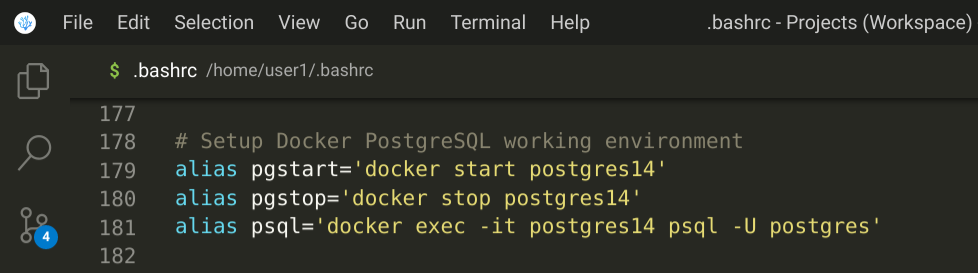

# docker-pg-dev

## Dockerize your PostgreSQL dev environment

> ***This tutorial requires some knowledge in Linux, Docker, Git, and PostgreSQL.***

### Why Postgresql?

**Postgresql is the epitome of the very definition of open-source project.**

I have some hesitance in using products that become projects. But projects that become products, that's something exciting and worth supporting. PostgreSQL is a project that has thrived as a product sold and supported by [many vendors](https://www.postgresql.org/support/professional_support/). PostgreSQL is quite an exciting project/product.

I hope more people use Postgresql. I drive around my car with a license [plate frame](https://www.cafepress.com/+postgresql_license_plate_frame,46809099) that advertises the project.

You can read more about its documentation, features, and history in [<ins>PostgreSQL.org</ins>](https://www.postgresql.org/about/). In IT environments strongly controlled by a competing commercial product this website might be blocked, so try this [Wikipedia site](https://en.wikipedia.org/wiki/PostgreSQL). If this Wikipedia site is also blocked by a "postgresql" URL keyword filter then too bad for you. You can try search more info on it. This just tells you that the database market is highly competitive.

### Database Container

You can read the Docker intro of the previous tutorial [Dockerize your Angular dev environment](https://github.com/cydriclopez/docker-ng-dev#docker-intro) as it is fitting here as well.

The pairing together of Docker container and database was initially perceived with hesitance by database professionals because of the ephemeral state of containers. State persistence is a required attribute of databases even after the container is no more.

In the advent of the usage of massively scalable durable storage volumes, it is now de rigueur to house databases in containers.

### PostgreSQL Container

For development purposes the pairing together of container and database is fitting. These days it makes a lot of sense to just download a self-contained complete database image rather than installing the database which in turn may require installing additional prerequisite software. You can even download separate docker images of different versions of the same database to try out.

I recommend <ins>***using only Docker Official Images***</ins> to keep away from malicious codes and vulnerabilities. You can also use images from companies you trust.

The Docker official repository of images is located in [<ins>hub.docker.com</ins>](https://hub.docker.com/). Here you can search for the docker image you can download. This is the docker hub page for [Postgresql](https://hub.docker.com/_/postgres).

Installing Postgresql from your Linux distro's package system is quite straightforward but the version of Postgresql is usually old. Then you may have to install the database client separately as well. The server and client versions have to be closely matched or you may experience strange incompatibility problems. I like to think that this tutorial will make it easy to just create then run the Postgresql docker image.

### PostgreSQL Container for development

This tutorial is mostly about 1.) creating the Postgresql docker image, 2.) Running the Postgresql docker image in detached mode, and 3.) adding 3 alias commands ***pgstart, pgstop, and psql*** in your ***~/.bashrc*** file. I stretched these into 6 steps for clarity.

**The key to using Docker in development is to bind mount your main project folder into a folder in the Docker image using the --volume or -v option. Once you have this mapping done then use the --workdir or -w option to declare this folder inside the Docker image as the working folder.**

```bash
docker run -d --name=postgres14 -p 5432:5432 \
--mount source=postgres_volume,target=/var/lib/postgresql/data \
-v /home/user1/Projects/psql:/home/psql \
-w /home/psql \
-e POSTGRES_PASSWORD="my-postgres-password" postgres
```

The parameters in the above ***docker run*** command can be included in the Dockerfile ***postgres.dockerfile*** but I like the flexibility of adding them in an alias command in my ***~/.bashrc*** file. Note that ***docker run*** options take precedence over anything in the Dockerfile; but some options (like -v/VOLUME) are [additive](https://forums.docker.com/t/does-docker-run-v-or-dockerfile-volume-take-precedence/22681).

Instead of typing the previous ***docker run*** command, with all its parameters, we will run a bash script ***postgres14*** in the docker folder. Later we will talk more about the preceding ***docker run*** command and its parameters.

We will also be adding 3 alias commands ***pgstart, pgstop, and psql*** in your ***~/.bashrc*** file.

### Dockerize Postgresql steps

The way I prefer to use Docker for Postgresql development purposes is to keep the image lean. To make it work takes 6 steps:

1. Git clone this project, then type ***cd docker-pg-dev/docker***
2. Build the image using the Dockerfile ***postgres.dockerfile***
3. Create your main Postgresql project folder with ***mkdir -p ~/Projects/psql***
4. Run image in detached mode by running bash script ***./postgres14***
5. Add 3 aliases your ~/.bashrc file as shown below
6. Reload your ~/.bashrc file with the command:   ***.   ~/.bashrc***

After step 6 you can run the alias command: ***pgstart***<br/>
Then type ***psql*** to run the client to connect to Postgresql.<br/>
To exit from the client type type ***\q***<br/>
To stop running the Postgresql server type ***pgstop***

The docker file ***docker/postgres.dockerfile*** is fully commented.
```dockerfile
# postgres.dockerfile
# Dockerize your PostgreSQL dev environment

# So you won't be typing "sudo docker" a lot, suggested
# Linux Docker post install commands:
# sudo groupadd docker
# sudo usermod -aG docker $USER

# 1. After git cloning this project type: cd docker-pg-dev/docker
# 2. Build the Angular image using the command:
# docker build -f postgres.dockerfile -t postgres .

# 3. Create your main Postgresql project working folder.
# You can create project sub-folders in this Postgresql project folder.
# mkdir -p ~/Projects/psql

# 4. While in the folder "docker-pg-dev/docker" run the script
# file "postgres14" by typing: ./postgres14

# This script will run the postgres image in detached mode, name it postgres14,
# create volume postgres_volume if not existing. This volume provides
# persistence when the container ceases running. It will also bind mount your
# project folder as the working folder.

# 5. Add these 3 aliases in ~/.bashrc
# alias pgstart='docker start postgres14'
# alias pgstop='docker stop postgres14'
# alias psql='docker exec -it postgres14 psql -U postgres'

# 6. Then reload ~/.bashrc by entering command:
# source ~/.bashrc

# After step #6. then you can type "psql" to connect to the database.
# To stop postgres14 type "pgstop".
# To start it again type "pgstart".

# To delete this postgres container:
# docker stop postgres14
# docker rm postgres14

# To delete the postgres image:
# docker rmi postgres

FROM postgres:latest
RUN mkdir -p /home/psql
```

---

### Some preliminaries for clarity

<ins>***Note that in the following command examples the colon ":" is part of my command-line prompt.</ins>
<br/>
<ins>You DO NOT type the colon ":" as part of the command.***</ins>
<br/>

Note that in Linux you can customize your command-line prompt. In my ***~/.bashrc*** file I have entered the following statement to customize my command-line prompt using the ***PS1*** environment variable.

```bash
export PS1=$PS1'\n:'
```

This statement in my ***~/.bashrc*** turns my command-line prompt into the following below. **This way no matter how long my current path is, my prompt starts at the leftmost part of my screen after the colon ":" character.**

```bash
user1@penguin:~/Projects/ng/my-app/node_modules/@angular/cli/src/commands/update/schematic$
:
```

So that you won't be typing ***sudo docker*** a lot, I suggest you run the following Linux Docker post install commands:

```
user1@penguin:~$
:sudo groupadd docker
:sudo usermod -aG docker $USER
```

### My laptop setup

***No I'm not endorsing or recommending it*** but for years now my choice work laptop is the [***Pixelbook Go***](https://store.google.com/us/product/pixelbook_go?hl=en-US). It has been out since 2019 but it is still a really nice useful development tool. I have the i5 16Gig RAM 128GB SSD model. Now there are way nicer laptops out there but I have been happy with this one and for the moment would not trade it for anything else out there. It runs an instance of [Debian](https://www.debian.org/) GNU/Linux 11 (bullseye) in a [LXD VM](https://linuxcontainers.org/lxd/) inside [Crostini](https://chromeos.dev/en/linux) which itself is based on Linux's built-in [KVM VM tool](https://www.linux-kvm.org/page/Main_Page). [Chrome OS](https://www.google.com/chromebook/chrome-os/) itself is based on the [Gentoo Linux distribution](https://www.gentoo.org/).

There is a lot of energy and excitement in the whole [Linux ecosystem](https://www.linuxfoundation.org/). The [Open Source Initiative](https://opensource.org/) was created to protect the open source intellectual property and ensure the whole ecosystem thrives.

Ok now that we have some clarity, let's get right to it. 😊

---

### 1. Git clone this project in a working folder

```
:git clone https://github.com/cydriclopez/docker-pg-dev.git
:cd docker-pg-dev/docker
```

### 2. Build the Postgresql image

Once inside the ***docker-pg-dev/docker*** folder build the Postgresql image using the command:

```
:docker build -f postgres.dockerfile -t postgres .
```

Note that there is a "dot" or a period "." at the end of this command. The period "." gives the current folder as context for the ***docker build*** command. It tells the ***docker build*** command where to find the docker file ***postgres.dockerfile***. Without the "-f" it looks for the default ***Dockerfile*** file. The "-t" names the docker target image. So when we type the command "docker images" it lists the created image as "postgres".

```
:docker images
REPOSITORY   TAG            IMAGE ID       CREATED        SIZE
angular      latest         809901e9120f   17 hours ago   170MB
postgres     latest         6a3c44872108   4 months ago   374MB
node         14.18-alpine   194cd0d85d8a   5 months ago   118MB
```

Note that the ***postgres*** entry was generated by the previous ***docker build*** command.

The ***angular*** and ***node*** image entries were created in the previous tutorial [***Dockerize your Angular dev environment***](https://github.com/cydriclopez/docker-ng-dev).

### 3. Create your main Postgresql project folder

Create your main Postgresql project working folder. This folder can be anywhere as long as it agrees with the volume mapping "-v" parameter in the next step.

In this example the main Postgresql project folder is ***~/Projects/psql***
So we type:

```
:mkdir -p ~/Projects/psql
```
In this project folder you can have several sub-folders to house your multiple Postgresql projects. I like to create a folder here for every database I create. At the end of this tutorial, in the ***Example usage*** section I will show you how.

We will create a folder ***postgres***, for the default ***postgres*** database, and a ***weather*** folder for our ***weather*** database that we will create. We will copy our sample script into our ***weather*** folder.

### 4. Run the script file ***postgres14***

In the folder ***docker-pg-dev/docker*** there is a bash script file ***postgres14***. Below shows its listing.

```bash
:cat postgres14
#!/bin/bash
# postgres14
# Make sure to run:
# chmod +x postgres14
# to make this bash script file executable. This script will run the
# postgres image in detached mode, name it postgres14, and create
# volume postgres_volume if not existing. This volume provides
# persistence when the container ceases running. It will also bind
# mount your project folder as the working folder.
docker run -d --name=postgres14 -p 5432:5432 \
--mount source=postgres_volume,target=/var/lib/postgresql/data \
-v /home/user1/Projects/psql:/home/psql \
-w /home/psql \
-e POSTGRES_PASSWORD="my-postgres-password" postgres
```

The ***-d*** option runs the docker container in the background or detached mode. This is in contrast to the way we ran the Angular docker image, in the [previous tutorial](https://github.com/cydriclopez/docker-ng-dev), with the "-it --rm" parameters. The ***--name=postgres14*** option names the running container ***postgres14***. The other parameters can be clarified by the following table.

### Table 1. Your host pc to Docker mappings table
|    | Your host pc | Docker |
| ----------- | --- | ----------- |
| postgresql port (-p) | 5432 | 5432 |
| docker volume (--mount) | postgres_volume | /var/lib/postgresql/data |
| volume mapping (-v) | /home/$USER/Projects/psql | /home/psql |
| working folder (-w) | (/home/$USER/Projects/psql) | /home/psql |
| environment variable (-e) |    | POSTGRES_PASSWORD=<br/>"my-postgres-password" |
| run docker image |    | postgres |

Run the script file by typing: ***./postgres14***

This script will run the postgres image in detached mode, name it ***postgres14***, and create volume ***postgres_volume*** if not existing. This volume provides database persistence when the container stops and then resume running. It will also bind mount your project folder as working folder.

Running the bash script file ***./postgres14*** returns the docker container id (64-character) ***UUID long identifier***. The command ***docker ps*** returns the shorter 12-character version ***UUID short identifier*** as shown below.

```bash
:./postgres14
ed0d2d87f67b5779d787c11df26f6f138b21156724bbe80ec1dc5a2e52dfe02a

:docker ps
CONTAINER ID   IMAGE      COMMAND                  CREATED              STATUS              PORTS                                       NAMES
ed0d2d87f67b   postgres   "docker-entrypoint.s…"   About a minute ago   Up About a minute   0.0.0.0:5432->5432/tcp, :::5432->5432/tcp   postgres14
```

As shown above typing ***docker ps*** lists the container ***postgres14*** as running. This confirms that our docker container ***postgres14*** is running in the background or detached mode.

### 5. Add these 3 aliases in ***~/.bashrc***

```bash
alias pgstart='docker start postgres14'
alias pgstop='docker stop postgres14'
alias psql='docker exec -it postgres14 psql -U postgres'
```

### Use your editor to add 3 alias commands ***pgstart***, ***psql***, and ***pgstop***

Use your code editor to edit your ***~/.bashrc*** file. In my case I enter the command:

```
:code ~/.bashrc
```

Then proceed to cut-and-paste those 3 aliases lines in the ***~/.bashrc*** file.

This is how it looks like in my code editor:<br/>


### 5. Save and reload your ~/.bashrc file

After you have inserted the alias command in your ***~/.bashrc*** file save it, and then reload it using the command:

```
:source ~/.bashrc
```

Remember, as I mentioned before, the colon ":" is part of the command line prompt. You do not type it.

After your ***~/.bashrc*** reloads, then the commands ***pgstart***, ***psql***, and ***pgstop*** become available.

Try enter this ***pgstart*** command. Then try connect with the client program ***psql*** command.

```bash
:pgstart
postgres14

:psql
psql (14.2 (Debian 14.2-1.pgdg110+1))
Type "help" for help.

postgres=# select version();
                                                           version
-----------------------------------------------------------------------------------------------------------------------------
 PostgreSQL 14.2 (Debian 14.2-1.pgdg110+1) on x86_64-pc-linux-gnu, compiled by gcc (Debian 10.2.1-6) 10.2.1 20210110, 64-bit
(1 row)

postgres=# select now();
              now
-------------------------------
 2022-06-30 09:09:42.622304+00
(1 row)

postgres=# \c
You are now connected to database "postgres" as user "postgres".

postgres=# \q

:pgstop
postgres14

:psql
Error response from daemon: Container ed0d2d87f67b5779d787c11df26f6f138b21156724bbe80ec1dc5a2e52dfe02a is not running
```

Then enter ***\q*** to exit the client program ***psql***. Typing ***pgstop*** stops Postgresql. Trying to connect again with ***psql*** returns an error message.

### Example usage

Make sure you are in the folder ***docker-pg-dev/docker*** as in step ***#1***. In this folder is the file ***sample.sql*** as shown the listing below.

Back in ***#3*** I mentioned that, in our Postgresql project folder ***~/Projects/psql***, I like to create a folder here for every database I create.

We will make 2 sub-folders in ***~/Projects/psql*** our Postgresql main project folder. Follow the 2 ***mkdir*** commands below.

Then we will run the command ***cp sample.sql ~/Projects/psql/weather*** to copy ***sample.sql*** into the ***weather*** sub-folder of our main Postgresql project folder. To confirm that it is there in the ***~/Projects/psql/weather*** folder, we use the ***ll*** command, which is actually an alias of ***ls -l*** command (set in ~/.bashrc).

```bash
:ll
total 12
-rwxr-x--- 1 user1 user1  507 Jun 29 17:26 postgres14
-rw-r--r-- 1 user1 user1 1484 Jun 29 16:59 postgres.dockerfile
-rw-r--r-- 1 user1 user1  778 Jun 30 03:03 sample.sql

:mkdir ~/Projects/psql/postgres

:mkdir ~/Projects/psql/weather

:cp sample.sql ~/Projects/psql/weather/

:ll ~/Projects/psql/weather/
-rw-r--r-- 1 user1 user1 778 Jun 30 11:30 sample.sql
```

Now let's start Postgresql by typing ***pgstart***, then ***psql*** to connect. Try follow the commands issued below.

```bash
:pgstart
postgres14

:psql
psql (14.2 (Debian 14.2-1.pgdg110+1))
Type "help" for help.

postgres=# \c
You are now connected to database "postgres" as user "postgres".

postgres=# \! pwd
/home/psql

postgres=# \! ls -l
drwxr-xr-x 1 1000 1000    0 Jun 30 18:15 postgres
drwxr-xr-x 1 1000 1000   20 Jun 30 18:30 weather

postgres=# \cd weather

postgres=# \! pwd
/home/psql/weather

postgres=# \! ls -l
-rw-r--r-- 1 1000 1000 778 Jun 30 18:30 sample.sql

postgres=#
```

Let's create the ***weather*** database then confirm that it does exist by entering ***\l*** to list all databases. The ***postgres*** database is the default.

Let's connect to our newly created database by typing: ***\c weather***

```bash
postgres=# create database weather;
CREATE DATABASE
postgres=# \l
                                 List of databases
   Name    |  Owner   | Encoding |  Collate   |   Ctype    |   Access privileges
-----------+----------+----------+------------+------------+-----------------------
 postgres  | postgres | UTF8     | en_US.utf8 | en_US.utf8 |
 template0 | postgres | UTF8     | en_US.utf8 | en_US.utf8 | =c/postgres          +
           |          |          |            |            | postgres=CTc/postgres
 template1 | postgres | UTF8     | en_US.utf8 | en_US.utf8 | =c/postgres          +
           |          |          |            |            | postgres=CTc/postgres
 weather   | postgres | UTF8     | en_US.utf8 | en_US.utf8 |
(4 rows)

postgres=# \c weather
You are now connected to database "weather" as user "postgres".

weather=#
```

The nice thing with the Linux terminal is that you can open several tabs in it, as many as you need. I usually open 3 to 5 tabs in my terminal as shown below.

This is my Postgresql database workspace:


This is my miscellaneous tab where I can open my code editor:


I even have an Angular tab:


This is the listing of our ***sample.sql*** script.

```sql
-- Sample stuff cut&pasted from
-- https://www.postgresql.org/docs/current/tutorial-table.html

CREATE TABLE weather (
    city            varchar(80),
    temp_lo         int,           -- low temperature
    temp_hi         int,           -- high temperature
    prcp            real,          -- precipitation
    date            date
);

CREATE TABLE cities (
    name            varchar(80),
    location        point
);

INSERT INTO weather VALUES ('San Francisco', 46, 50, 0.25, '1994-11-27');

INSERT INTO cities VALUES ('San Francisco', '(-194.0, 53.0)');

INSERT INTO weather (city, temp_lo, temp_hi, prcp, date)
    VALUES ('San Francisco', 43, 57, 0.0, '1994-11-29');

INSERT INTO weather (date, city, temp_hi, temp_lo)
    VALUES ('1994-11-29', 'Hayward', 54, 37);

```

Now that we are in the ***weather*** database. Let's confirm that we are in the ***weather*** folder.

Let's run our ***sample.sql*** script using the command: ***\i sample.sql***

```bash
weather=# \c
You are now connected to database "weather" as user "postgres".

weather=# \! pwd
/home/psql/weather

weather=# \! ls -l
-rw-r--r-- 1 1000 1000 778 Jun 30 18:30 sample.sql

weather=# \i sample.sql
CREATE TABLE
CREATE TABLE
INSERT 0 1
INSERT 0 1
INSERT 0 1
INSERT 0 1

weather=#
```

We list all the tables we have in our ***weather*** database using ***\dt*** command. Then let's try query our tables.

```sql
weather=# \dt
 public | cities  | table | postgres
 public | weather | table | postgres

weather=# select * from cities;
 San Francisco | (-194,53)

weather=# select * from weather;
 San Francisco |      46 |      50 | 0.25 | 1994-11-27
 San Francisco |      43 |      57 |    0 | 1994-11-29
 Hayward       |      37 |      54 |      | 1994-11-29

weather=#
```

I hope this has been a good introduction into ***Dockerize your Postgresql dev environment.***

Happy coding! 😊

---
